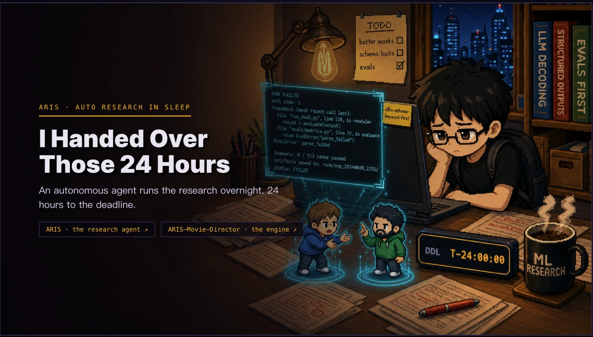
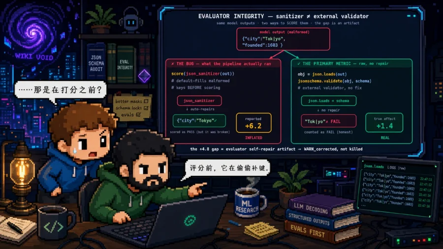
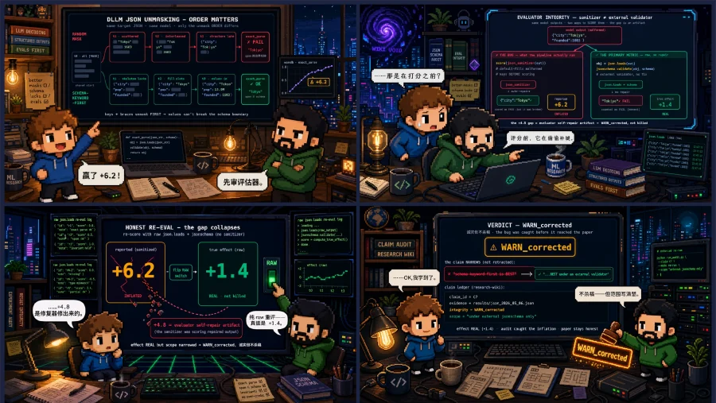
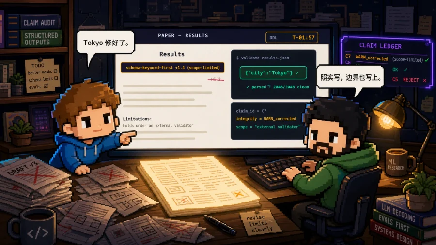

<p align="center">
  
</p>

# ARIS-Movie-Director

> Hand a fuzzy story to your agent, wake up to a **cross-model-audited movie** 🎬 — no forgotten facts, no frame signing off on itself.<br>
> *🎞️ Image-based today, **video next**.*<br>
> *🤖 Agentic by design — planning · gating · cross-model review on the **agent**; rendering on the **diffusion model**.*

**📚 Jump to** — [▶ Watch the movie](https://wanshuiyin.github.io/ARIS-Movie-Director/comic/) · [⚡ Quick Start](#quick-start) · [🔄 Workflows](#workflows) · [📝 Make your own](skills/movie-pipeline/SKILL.md) · [🧩 Layout](#layout) · [💬 Community](#community) · [📖 Cite](#citation) · [🤝 Contributing](CONTRIBUTING.md)

[](#community) · [](#citation) · [](https://github.com/wanshuiyin/ARIS-Movie-Director/actions/workflows/ci.yml) · [](https://github.com/wanshuiyin/Auto-claude-code-research-in-sleep/stargazers) · [](https://huggingface.co/papers/2605.03042) · [](https://huggingface.co/papers/2605.03042) · [](https://github.com/wanshuiyin/Auto-claude-code-research-in-sleep) · [](https://github.com/VoltAgent/awesome-agent-skills)

**This is an agentic, long-horizon visual generation task:** hand a fuzzy story to an agent and produce a whole
image-based movie (the reference run is a **19-scene / 24-frame** story), not a single image. The concrete job is
`fuzzy story → authored comic.json → audited panels → single-file viewer`.

**The hard part is faithfulness over time.** Generated visual stories can look coherent while quietly changing
the facts — a chart rounds a number, a label mutates, a character's face drifts — and the run still ships,
because the same system that drew the frame is the one saying it looks fine. Across a long horizon, two failure
modes dominate:

- 🧠 **Long-range forgetting** — over many frames, identity, established facts, and earlier decisions drift.
- 🗣️ **Linear, self-approved streaming** — each frame is committed by the model that drew it, so mistakes compound unchecked.

**🔬 Method at a glance.** Read the figure left-to-right — the [`/movie-pipeline`](skills/movie-pipeline/SKILL.md)
agent workflow runs the full loop (*author a source of truth → bake → cross-model gate*): **(1)**
[`comic-author`](skills/comic-author/SKILL.md) turns fuzzy intent into an authored `comic.json` + locked refs,
**(2)** [`comic-director`](skills/comic-director/SKILL.md) runs the per-panel audited spiral — the **multi-agent
debate** (CC ‖ Gemini ‖ Codex blind-read → deterministic diff), logging every attempt / decision to the
**[research-wiki](examples/comic_m3_audit/wiki/)** — **(3)** the pipeline assembles accepted panels into the
released viewer. The bottom-left failure is the whole rule: *a beautiful but wrong literal still fails*
(`+6.2` expected vs `+6.25` observed).


<sub>**Figure 1** — from story intent to a verified movie, end-to-end (the loop described above). Full caption ↓</sub>

<details><summary><b>Figure 1 — stages, gates, and provenance</b> (click to expand)</summary>

> **(1) Authored source of truth** — asset library · outline · storyboard compile into `comic.json` (`content_svg · expected_literals · identity_ref`). **(2) The audited spiral (per panel)** — a content-SVG blueprint is baked by image_gen, then a 3-reviewer cross-model `panel_gate` (CC narrative ‖ Gemini + Codex visual *blind-transcribe* → a deterministic token-diff · single-vote veto) returns a deterministic `verdict`: **KEEP**, or **RETRY** (≤4/panel) re-baked with the failed attempt's repair note; every attempt/review/decision/failure is logged to the `research-wiki`. **(3) Assembly + release** — a cast-aware `page_assembly_gate` (repair drift → re-bake, ≤6/run) ships PNG panels + a single-file HTML viewer. The punchline (bottom-left): **a beautiful panel with a wrong number does not pass** — `+6.2` expected vs `+6.25` observed fails the token-diff.
>
> *This figure was itself produced by the same loop it depicts: a labeled blueprint conditioned `gpt-image-2` (driven by Codex GPT-5.5 xhigh), then 4 generation rounds were ratified by the method-figure panel — **Gemini + Codex blind-transcribe + a deterministic `content_diff`, then a Claude structural sign-off** — until clean. The **exact prompt sequence that baked this image** (all 4 rounds + the cross-model critiques) is published verbatim as a reference: [`skills/method-figure/examples/method_figure/PROMPTS.md`](skills/method-figure/examples/method_figure/PROMPTS.md).*

</details>

**ARIS-Movie-Director treats every frame as an auditable artifact:** author a deterministic `comic.json` first
(lock the `expected_literals` + identity refs *before* any pixels), let a generative model bake the look, then
require **independent cross-model blind-transcription + a deterministic token-diff** before a panel is kept.
*Looks right ≠ passes* — a beautiful frame with a wrong literal is rejected. It answers the two failure modes
with two ideas from the [ARIS](https://github.com/wanshuiyin/Auto-claude-code-research-in-sleep) series:
- 🧠→ a **[research-wiki](examples/comic_m3_audit/wiki/)** — persistent, inspectable memory (locked refs · `expected_literals` · every decision & failure as a node) that anchors late frames to early truth.
- 🗣️→ **multi-agent debate** — independent cross-model reviewers blind-read every frame and a deterministic diff decides **KEEP / RETRY**, so **no frame signs off on itself**. Every attempt / decision lands in that wiki trace.

**This first release is image-based** — the movie is told in baked still frames you flip through. **Video-based generation is what comes next; this is just the beginning.**

> **▶ [Watch the image-based movie in your browser](https://wanshuiyin.github.io/ARIS-Movie-Director/comic/)** — flip through all 19 scenes of the cross-model-audited reference run.

[](https://wanshuiyin.github.io/ARIS-Movie-Director/comic/)

<table><tr><td width="33%"><a href="https://wanshuiyin.github.io/ARIS-Movie-Director/comic/"></a></td><td width="33%"><a href="https://wanshuiyin.github.io/ARIS-Movie-Director/comic/"></a></td><td width="33%"><a href="https://wanshuiyin.github.io/ARIS-Movie-Director/comic/"></a></td></tr></table>

<sub>A few frames from the reference movie — including the story's own integrity beat: a run that **reported `+6.2`** improvement but **really moved `+1.4`** (that's the *plot*, distinct from the figure's bake-time `+6.2`/`+6.25` token-diff). **[Watch all 19 scenes →](https://wanshuiyin.github.io/ARIS-Movie-Director/comic/)**</sub>

<details><summary><b>⚡ What the audit gate actually catches</b> — the problem → mechanism table</summary>

| The problem | What ARIS-Movie-Director does about it |
|---|---|
| A panel can look right while changing a number, label, or code token. | `comic.json` locks the `expected_literals`; independent visual reviewers **blind-transcribe** what's actually in the pixels; an exact token-diff rejects any wrong or missing literal. |
| The model that baked an image can wave its own output through. | The bake never self-attests — independent visual models (a **different family** from the generator) read it blind, and a **deterministic** diff, not a model's opinion, decides **KEEP / RETRY**. |
| A frame can be baked with nothing to check it against. | Phase 1 authors `content_svg` · `identity_ref` · `ART_BIBLE` · `expected_literals` *before* pixels; a baked figure-panel with **no** gateable literals **fails closed**. |
| Character & style drift accumulate across a long sequence. | Locked identity refs + asset review (准×3) + a style bible + a **cast-aware** assembly gate check consistency *while allowing* intended scene/cast variation (absence ≠ drift). |
| Retry loops go opaque or endless. | Per-panel attempts and assembly repairs are **bounded**; each failure carries a repair note; a non-convergent panel is **flagged for a human**, never silently shipped. |
| A demo hides what was tried and thrown away. | Every attempt / review / decision / failure-mode is written to the research-wiki — the reference run ships a **198-node** trace you can read. |

</details>

---

<a id="quick-start"></a>

## ⚡ Quick Start

```bash
# 1 · get the repo + Python deps  (everything but jsonschema is stdlib)
git clone https://github.com/wanshuiyin/ARIS-Movie-Director.git && cd ARIS-Movie-Director
python3 -m pip install -r requirements.txt

# 2 · external tools for the bake/review stages — install + authenticate, then verify:
#     codex CLI  ·  gemini CLI (uses auto-gemini-3)  ·  headless Chrome / Chromium
python3 cli/preflight.py
```
There is **no bundled installer** — the `skills/` are *followed by your coding agent pointed at this repo*; the deterministic CLIs run in-repo.

**Run the two workflows** — in a coding agent that has these skills (`/…` is a **slash-command agent workflow**, *not* a shell binary):
```text
> /movie-pipeline "a short film about an autonomous research run"   # Workflow 1 — fuzzy idea → audited movie + viewer (pauses at intent + outline)
> /method-figure  path/to/method_figure_brief.json                 # Workflow 2 — a brief → audited Figure-1 (render + verify → Claude sign-off)
```

**See it first — zero setup, no API:** ▶ open the hosted movie at **<https://wanshuiyin.github.io/ARIS-Movie-Director/comic/>** (all 19 scenes / 24 frames). To rebuild it locally, see **Workflow 1 → See the reference movie** below.

<sub>**Full map** — `fuzzy story → /movie-pipeline → comic.json + audited panels + outputs/index.html`  ·  `method_figure_brief.json → /method-figure → figure.png + blueprint + trace`</sub>

---

<a id="workflows"></a>

## 🔄 Workflows

Two cross-model-audited workflows. Each is **one slash-command agent workflow** (the ARIS `/research-pipeline`
paradigm — an agent runs it, pausing at the human gates), with a **deterministic CLI core** you can also run
standalone (the part CI tests).

### 🎬 Workflow 1 · Movie pipeline — `/movie-pipeline` (fuzzy idea → audited movie)
Hand your agent a fuzzy story, approve two story gates, wake up to a baked, cross-model-audited movie + a clickable viewer:
```text
> /movie-pipeline "a short film about an autonomous research run"
```
It chains [`comic-author`](skills/comic-author/SKILL.md) (Phase 1 — author the source of truth) → the zero-credit
`p0_proof` gate → [`comic-director`](skills/comic-director/SKILL.md) (Phase 2/3 — the audited spiral → viewer); the
orchestrator is [`movie-pipeline`](skills/movie-pipeline/SKILL.md). It's an **agent** workflow, not a shell binary —
it needs a coding-agent runtime and **pauses at intent + outline for your approval**. *(A step that doesn't fire is
safe — each layer consumes the prior LOCKED node, so a skipped step fails closed at the next gate, never shipping a
wrong frame.)*

- 🧭 **Intent** — fuzzy idea → `intent_spec` · **stop for your approval**
- 🎨 **Style lock** — the `ART_BIBLE.md` + locked `style_anchor`s (warm-lab / dark-cyber / starfield)
- 🧱 **Outline** — 3-lens debate → synthesis → `outline_spec` · **stop for your approval**
- 🎞️ **Storyboard** — pages · panels · the MOTIF STATE TABLE · consolidated `asset_requests`
- 🧑‍🎨 **Assets** — a single-source library, reviewed to `locked` (准×3 same-round unanimity)
- 📐 **Blueprints** — a deterministic `content_svg` per panel (no baked bubbles)
- 🧾 **Prompts** — exact bake prompts + verbatim `expected_literals` (搬运工原則)
- ✅ **Compile** — schema-valid `comic.json`; the zero-credit `p0_proof` gate runs BEFORE any image credit
- 🔥 **Spiral bake** — render → `codex image_gen` → 3-reviewer `panel_gate` → keep / retry / cross-frame rollback → assembly → viewer

**📐 Flow — the skill chain (trace it top-to-bottom):**

```text
/movie-pipeline "fuzzy idea"            one slash-command · agent-run, NOT a shell binary
   │
   ▼   comic-author drives these Phase-1 skills IN ORDER (they are not separate slash-commands):
   comic-intent-parser
     → ⟨HUMAN APPROVE — intent⟩
     → comic-style-bible-lock
     → comic-outline-creator
     → ⟨HUMAN APPROVE — outline⟩
     → comic-storyboard-creator
     → comic-asset-ref-generator → comic-asset-review-loop          (准×3 unanimity → assets LOCKED)
     → comic-blueprint-author → comic-panel-prompt-builder → comic-json-compiler
   ├──────────────── Phase 1 · comic-author — author the source of truth ────────────────┤
   │
   │   → comic.json + locked assets + the author wiki trace
   ▼
   comic-cross-layer-gate --gate p0_proof     ├─ P0 · ZERO-CREDIT proof — must pass before any image credit ─┤
   │
   ▼   comic-director — the audited spiral     (run_comic.py  |  packages/core/spiral_engine.js)
   per panel:  content_svg → codex image_gen → panel_gate
                  reviewers: CC narrative ‖ Gemini visual ‖ Codex visual
                  → blind transcriptions → deterministic token-diff vs expected_literals
               verdict ─ KEEP → page pool
                       ├ RETRY ≤4   (re-bake the SAME panel + repair note)
                       └ rollback ≤6 (re-bake NAMED prior panels — cross-frame drift)
   page assembly_gate → project accepted panels to comic.json → build_comic.py → outputs/index.html
   ├──────────────── Phase 2/3 · comic-director — audited spiral + viewer ────────────────┤

   📚 research-wiki — reads the locked source nodes before each layer; writes every attempt / review /
                      decision / failure after each gate & bake (the inspectable audit trace).
   🔄 human-in-loop — intent + outline are HARD stops; a failed p0 / panel / assembly gate stops or
                      escalates; a non-convergent panel is flagged for you, never silently shipped.
```

**The `panel_gate`** (Phase 2/3, per panel): the bake is read by **3 independent reviewers** — CC *narrative*
(does it land the beat?) ‖ Gemini *visual* ‖ Codex *visual* (a second, different-family eye) — who
**blind-transcribe** the pixels; a **deterministic** token-diff of `observed_literals` vs the authored
`expected_literals` decides KEEP / RETRY; `content_corruption` is a single-vote veto, both visual reviewers must
score, and **no model self-acquits**. Every attempt / review×3 / decision / failure is written to the `research-wiki`.

**Phase 2/3 standalone** (deterministic, no agent — the CI-tested slice), once `comic.json` exists:
```bash
python3 skills/comic-director/scripts/run_comic.py --project examples/<name> --page <PAGE> --panels S01,S02 --dry-run    # zero credit: prints bake prompts
python3 skills/comic-director/scripts/run_comic.py --project examples/<name> --page <PAGE> --panels S01,S02 --finalize   # bake + rebuild the viewer
```
`run_comic.py` is a subprocess port of [`packages/core/spiral_engine.js`](packages/core/spiral_engine.js) (no agent
runtime); it starts from an existing `comic.json` — **it cannot start from a fuzzy idea**. **Throttling:** a
rate-limited bake stops cleanly with `fresh_run_required` — after cooldown launch a **fresh** run for the remaining
panels, do **not** resume cached state. Caps: **≤4 attempts/panel · ≤6 rollbacks/run · no concurrent bakes**
([`docs/spiral-runtime.md`](docs/spiral-runtime.md)).

**Authoring template:** copy the Phase-1 author-node shapes from [`examples/comic_min_author/`](examples/comic_min_author/)
when adding a new project. The flow diagram above is the canonical skill chain — the two human gates and the
fail-closed gates are shown there; prereqs (codex + gemini + headless Chrome) are in [Quick Start](#quick-start).

#### ▶️ See the reference movie — what Workflow 1 produces (zero setup, no API)
```bash
python3 cli/validate_wiki.py examples/comic_m3_audit             # verify the shipped trace → PASS (198 nodes, 26 edges)
python3 packages/viewer/build_comic.py examples/comic_m3_audit  # (re)build the single-file viewer from comic.json + panels
open  examples/comic_m3_audit/outputs/index.html
```
…or just open the hosted one: **<https://wanshuiyin.github.io/ARIS-Movie-Director/comic/>** — all **19 scenes / 24 frames** of the cross-model-audited reference run.

### 🖼️ Workflow 2 · Method figure — `/method-figure` (a brief → Figure-1)
One **slash-command**, [`/method-figure`](skills/method-figure/SKILL.md) — give it a `method_figure_brief.json`
(the same brief `paper-plan` emits after its claims_matrix) and it runs the whole audited spiral to a signed-off
figure (Step-0 compile → render condition → `gpt-image-2` bake → Gemini + Codex blind panel + `content_diff` →
retry until clean → **Claude structural sign-off**):

```text
> /method-figure path/to/method_figure_brief.json
```

The **deterministic core** (from a brief, no agent runtime) is one command — `run_spiral.py`:
```bash
# OUR example brief bakes ARIS's own Figure 1 — swap in your own method_figure_brief.json
python3 skills/method-figure/scripts/run_spiral.py \
    skills/method-figure/examples/method_figure/method_figure_brief.json \
    --out-dir figures/method_figure/demo
#  → figures/method_figure/demo/figure.png   (the PANEL-CLEAN candidate, awaiting your structural sign-off)
#     (+ blueprint.json + traceability.json + trace.jsonl of every round)
#  first run? add --p0-only (zero image credits: validate + compile + render + lint). NOTE: --dry-run still writes these files.
```

<details><summary>📐 flow — /method-figure (brief → audited render → sign-off)</summary>

```text
(upstream — only if you have a paper; NOT part of /method-figure):
   paper_to_brief.md  →  method_figure_brief.json      agent-authored; claims / numbers copied VERBATIM
        │
        ▼
/method-figure  <method_figure_brief.json | blueprint.json>        the skill = pure render + verify
   run_spiral.py — the deterministic core (starts from a brief):
     compile_brief.py (Step-0) → blueprint.json + traceability.json     every node traces to a brief field — else FAIL-CLOSED
       → validate_blueprint.py → render_condition.py                    labeled condition SVG → PNG
       → codex exec --sandbox read-only → gpt-image-2 bake
       → Gemini blind-transcribe ‖ Codex blind-transcribe → content_diff.py     deterministic vetoes
       → RETRY ≤4 (re-assert the locked labels) → Claude STRUCTURAL sign-off
   → figure.png   (+ blueprint.json + traceability.json + trace.jsonl of every round)
   ├──────────────── method-figure · audited render / verify spiral ────────────────┤
```
</details>

Step-0 is deterministic **inside the skill** — you never hand-write a blueprint or place coordinates; the identity
sheet resolves from the brief's `identity_refs[].path` (no separate `--identity`); every node is
traceability-checked back to a brief field (un-traceable → fail-closed). **No model self-acquits** — the bake is
ratified by Gemini + Codex blind reads + a deterministic `content_diff`, then a separate **Claude structural
sign-off**. Needs the **`codex` + `gemini` CLIs** + headless Chrome (`python3 cli/preflight.py`).

> **Only have a paper, no brief yet?** Author the brief FIRST — point your coding agent (e.g. the
> **[ARIS](https://github.com/wanshuiyin/Auto-claude-code-research-in-sleep) main project**) at your paper via
> [`paper_to_brief.md`](skills/method-figure/references/paper_to_brief.md) (claims/numbers verbatim) — then
> `/method-figure` it. **Power-user:** already have a hand-tuned blueprint? `run_spiral.py blueprint.json
> --identity sheet.png --out-dir … --from-blueprint` runs the legacy path. The worked 4-round convergence (the
> exact prompts) is in [`PROMPTS.md`](skills/method-figure/examples/method_figure/PROMPTS.md).

### 🛡️ Why the two gates differ (both correct, by design)
The **movie** `panel_gate` is a **3-reviewer** panel (CC *narrative* ‖ Gemini *visual* ‖ Codex *visual*) — a story
panel must land its beat AND be visually on-model. The **method-figure** panel is **Gemini + Codex
blind-transcribe + the deterministic `content_diff`**, with **Claude** the post-pass structural sign-off — a
figure has no "beat", so the bar is exact labels + clean layout, not narrative. Both obey the one rule:

> The gate is the point: a beautiful panel/figure with a wrong number does **not** pass. Faithfulness is a
> token-diff over reviewers who are never shown the expected values.

<a id="positioning"></a>

## 🧭 Positioning — ARIS lineage; an audit layer, *not* a generation/orchestration claim

ARIS-Movie-Director is the **multimodal vertical of the [ARIS](https://github.com/wanshuiyin/Auto-claude-code-research-in-sleep) series**: ARIS taught a research agent to work while you sleep, and its **research-wiki + multi-agent-debate** ideas are exactly what make a generated story *auditable* — the same loop (author a source of truth → let a model bake the look → ratify with a cross-model panel), now producing character-consistent visual stories instead of papers.

The framework knows nothing about any particular story — a project plugs in via `examples/<name>/movie.project.json` + a `comic.json` IR. The reference example builds a **19-scene / 24-frame** pixel-art movie about an autonomous research run, and ships its **real, inspectable generation trace** as proof the multi-agent loop actually ran.

**Related work — where we fit.** The field already generates and orchestrates visual stories well, and we build on that, not against it: **[JoyAI-Echo](https://github.com/jd-opensource/JoyAI-Echo)** (JD) is strong at long-form text→video with synced audio and memory-based character consistency; **[FireRed-OpenStoryline](https://github.com/FireRedTeam/FireRed-OpenStoryline)** (Xiaohongshu) is a strong conversational video-editing agent — NL planning, tool orchestration, human-in-the-loop, reusable style skills; **[NEWTON](https://arxiv.org/abs/2605.18396)** shows planner-plus-verifier loops for *physically*-grounded video. ARIS-Movie-Director is **complementary** — it doesn't claim better generation or broader orchestration; it adds the **audit layer** around a generated visual story: blind cross-model reads → deterministic literal-diffs → bounded retry → an inspectable trace.

---

<a id="layout"></a>

## 🧩 Layout

- **packages/** — the framework runtime (core spiral, gates, conditioning, viewer)
- **protocols/** — the cross-model review / governance contracts (framework-owned)
- **schemas/** — versioned IR + wiki schemas (`comic.schema.json`, `node_schema.json`, `edge_schema.json`)
- **cli/** — `validate_wiki.py` (the stdlib release gate for a project's wiki)
- **docs/** — `comic-json.md` (the authored-input spec), `architecture.md` (SSOT), `spiral-runtime.md`, `GENERATION_RETRO.md`
- **examples/comic_m3_audit/** — the reference movie: `comic.json` IR, `gen/` blueprint scripts,
  `panels/` baked art, `wiki/` the 198-node generation trace, `outputs/` the built viewer

<a id="community"></a>

## 💬 Community

**New workflows, gates, and example projects welcome.** ARIS-Movie-Director is part of the [ARIS](https://github.com/wanshuiyin/Auto-claude-code-research-in-sleep) series — PRs that add an audited workflow, a gate with teeth, an example project, or a domain adaptation are welcome (start at [CONTRIBUTING.md](CONTRIBUTING.md)).

Join the WeChat group (shared with the ARIS main project) for discussion on Claude Code + AI-driven multimodal generation:


<a id="citation"></a>

## 📖 Citation

ARIS-Movie-Director is the multimodal vertical of the **ARIS** series. If you use it in your research, please cite the ARIS paper:

```bibtex
@article{yang2026aris,
  title={ARIS: Autonomous Research via Adversarial Multi-Agent Collaboration},
  author={Yang, Ruofeng and Li, Yongcan and Li, Shuai},
  journal={arXiv preprint arXiv:2605.03042},
  year={2026}
}
```

## 📄 License

**MIT** — see [`LICENSE`](LICENSE).

The example artwork is **AI-generated** — this is a disclosure, not a second license; reuse should still follow your image-model provider's terms.
